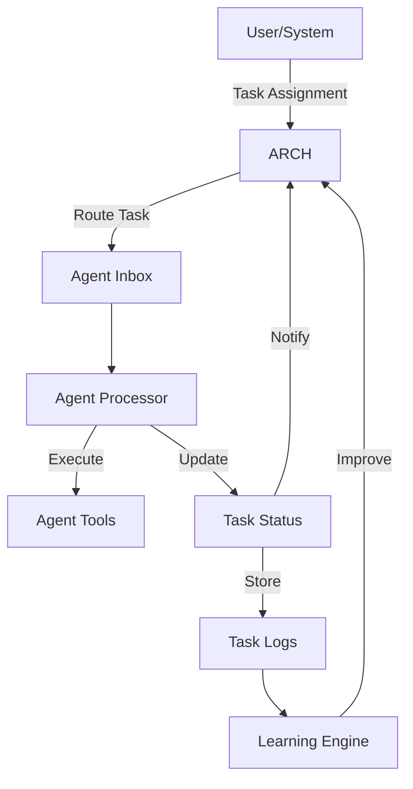

# Agent Architecture

## Overview

Bluelabel Agent OS is built around a set of specialized agents that collaborate to accomplish complex tasks. This document outlines the architecture, roles, and interactions of these agents.

## Agent Roles Summary

| Agent | Role | Primary Responsibilities | Communication Style |
|-------|------|--------------------------|---------------------|
| **ARCH** | Task Router & Coordinator | Task routing, monitoring, coordination | Asynchronous, Push |
| **CC** | Backend Infrastructure | Core system implementation, message handling | Asynchronous, Push |
| **CA** | Task Implementation | Code implementation, documentation | Asynchronous, Pull |
| **WA** | Web Interface | User interaction, web tools | Asynchronous, Push |

## Agent Lifecycle

1. **Initialization**
   - Load agent profile and configuration
   - Initialize required tools and resources
   - Register with the message router

2. **Operation**
   - Monitor inbox for new messages
   - Process messages based on type
   - Execute assigned tasks
   - Send status updates and results
   - Handle errors and retries

3. **Shutdown**
   - Complete in-progress tasks
   - Save state if necessary
   - Send final status updates
   - Release resources

## Agent Profiles

### ARCH (Task Router & Coordinator)

**Profile**: [ARCH_PROFILE.md](../contexts/ARCH_PROFILE.md)

**Responsibilities**:
- Route tasks to appropriate agents
- Monitor task progress and status
- Coordinate between agents
- Maintain task queue and priorities
- Ensure task completion and quality

**Tools**:
- Task router
- Status tracker
- Priority queue manager
- Coordination tools

### CC (Backend Infrastructure)
**Profile**: [CC_PROFILE.md](../contexts/CC_PROFILE.md)

**Responsibilities**:
- Implement and maintain core systems
- Handle message routing and processing
- Manage system state and archives
- Provide debugging capabilities

**Tools**:
- Message validator
- File system manager
- Logging system
- Configuration manager

### CA (Task Implementation)
**Profile**: [CA_PROFILE.md](../contexts/CA_PROFILE.md)

**Responsibilities**:
- Implement assigned tasks and features
- Write and modify code
- Provide code reviews
- Maintain documentation
- Handle error resolution

**Tools**:
- Code editor
- Version control integration
- Documentation generator
- Testing framework

### WA (Web Interface)
**Profile**: [WA_PROFILE.md](../contexts/WA_PROFILE.md)

**Responsibilities**:
- Manage web-based user interactions
- Handle user input and requests
- Provide web interface updates
- Manage web configurations

**Tools**:
- Web server
- UI components
- Form handlers
- Web APIs

## Message Flow

## Context Handling

Each agent maintains its own context including:
- Current task state
- Message history
- Configuration settings
- Tool-specific state

Context is persisted in the agent's workspace and restored on restart.

## Tool Integration

Agents interact with tools through a standardized interface:

1. **Tool Discovery**: Agents can list available tools
2. **Tool Invocation**: Agents call tools with required parameters
3. **Result Handling**: Tools return structured results
4. **Error Handling**: Standardized error reporting

## Error Handling

1. **Message Validation**: Validate incoming messages
2. **Retry Logic**: Automatic retries for transient failures
3. **Fallback**: Alternative actions on failure
4. **Notification**: Alert relevant agents of issues
5. **Logging**: Detailed error logging for debugging

## Security Considerations

- Message validation and sanitization
- Access control for sensitive operations
- Secure storage of credentials
- Audit logging of all operations

## Performance Considerations

- Asynchronous processing
- Efficient message serialization
- Resource usage monitoring
- Load balancing for high-traffic agents

## Monitoring and Observability

- Health checks
- Performance metrics
- Usage statistics
- Error rates and patterns
