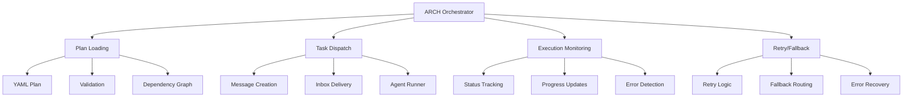
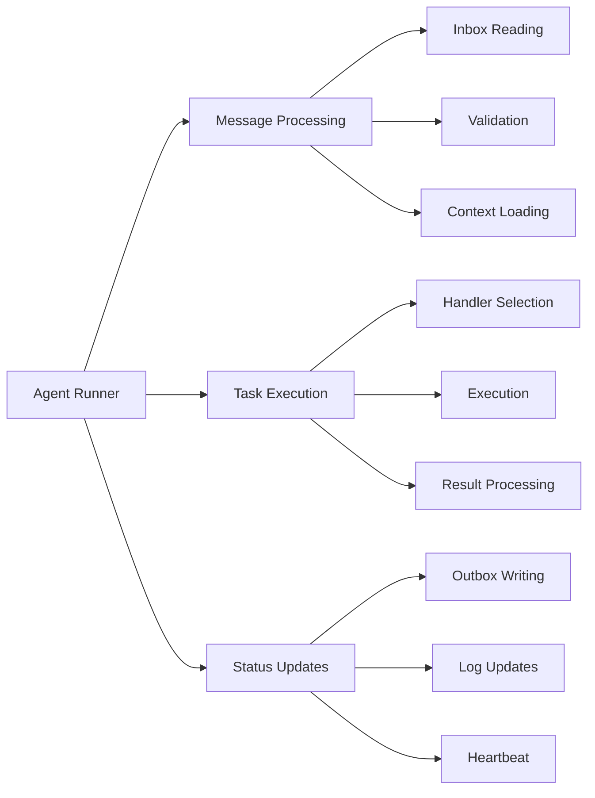
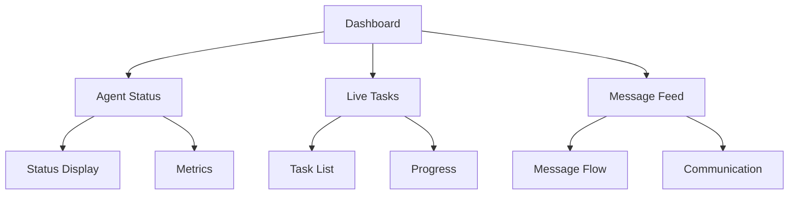
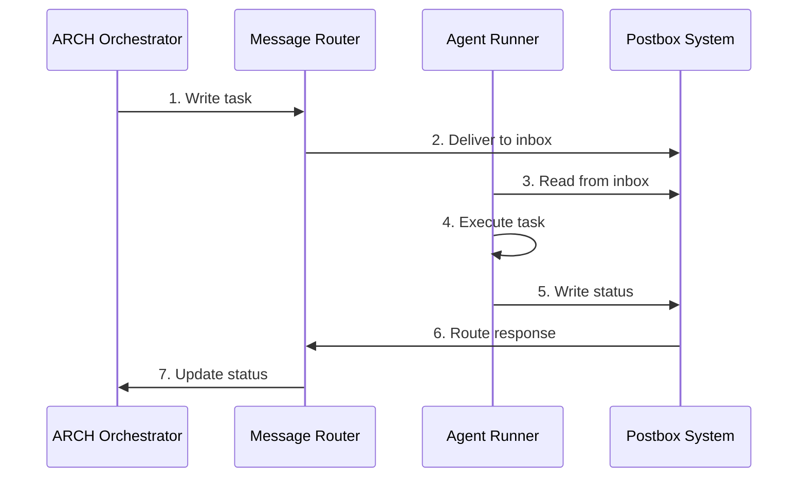
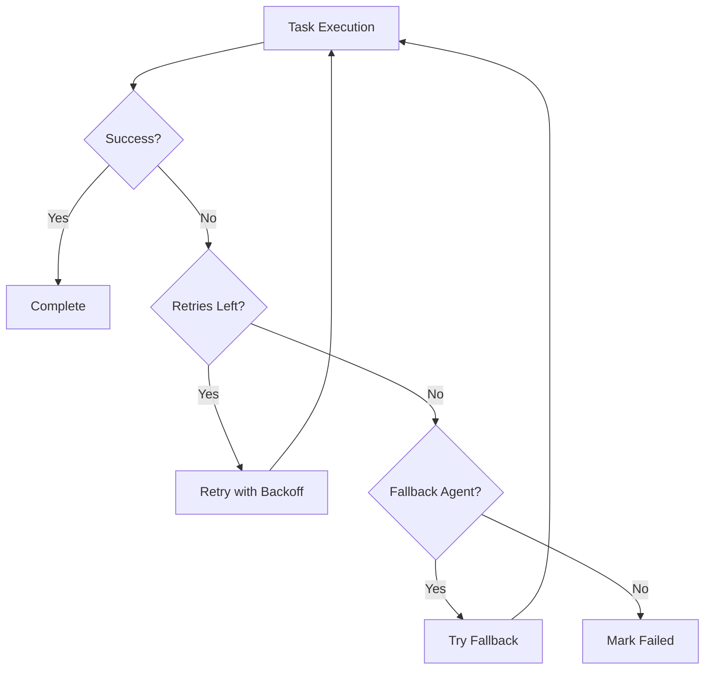

# Bluelabel Agent OS Architecture

## System Overview

Bluelabel Agent OS is a multi-agent system that enables AI assistants to collaborate on software development tasks through a file-based communication system. The platform provides a robust framework for task orchestration, agent coordination, and execution monitoring.

## Core Components

### 1. ARCH Orchestrator
The central coordination component that manages task execution and agent communication.



### 2. Agent Runner
Manages individual agent execution and message processing.



### 3. Postbox System
File-based message passing system for inter-agent communication.

```
/postbox/
├── ARCH/
│   ├── inbox.json    # Incoming tasks
│   ├── outbox.json   # Status updates
│   └── task_log.md   # Execution log
├── CA/
├── CC/
└── WA/
```

### 4. Dashboard
Real-time monitoring interface for system status and activities.



## Message Flow



## System Layers

### 1. Communication Layer
- File-based message passing
- Message validation and routing
- Protocol enforcement
- Message archiving

### 2. Execution Layer
- Task scheduling and dispatch
- Dependency management
- Retry and fallback logic
- Error handling

### 3. Monitoring Layer
- Real-time status tracking
- Performance metrics
- Error reporting
- Activity logging

### 4. UI Layer (Current)
- Terminal-based dashboard
- Real-time updates
- Interactive controls
- Data export

### 5. Future API Layer (Planned)
- RESTful API endpoints
- WebSocket support
- Authentication/Authorization
- Rate limiting

## Retry and Fallback System



## Current Status

### Implemented Features
- File-based message passing
- Basic task orchestration
- Terminal dashboard
- Agent status monitoring
- Task tracking
- Message logging

### In Progress
- Retry and fallback mechanisms
- Task dependencies
- Context awareness
- Learning system

### Planned Features
- REST API layer
- WebSocket support
- Advanced error recovery
- Performance optimization
- Extended monitoring capabilities

## Best Practices

1. **Message Handling**
   - Always validate messages against schema
   - Use proper message types and formats
   - Handle errors gracefully
   - Archive processed messages

2. **Task Management**
   - Define clear task boundaries
   - Specify dependencies explicitly
   - Include retry and fallback options
   - Document task requirements

3. **Agent Communication**
   - Follow protocol specifications
   - Maintain task logs
   - Update status promptly
   - Handle timeouts appropriately

4. **System Maintenance**
   - Monitor system health
   - Clean up old messages
   - Backup important data
   - Update documentation

## Security Considerations

1. **Message Security**
   - Validate all inputs
   - Sanitize message content
   - Protect sensitive data
   - Implement access controls

2. **System Security**
   - Secure file permissions
   - Monitor system access
   - Log security events
   - Regular security audits

## Future Roadmap

### Short-term (1-2 months)
- Complete retry/fallback implementation
- Add task dependency support
- Enhance error handling
- Improve monitoring capabilities

### Medium-term (3-6 months)
- Implement REST API
- Add WebSocket support
- Develop learning system
- Enhance security features

### Long-term (6+ months)
- Advanced AI capabilities
- Distributed deployment
- Cloud integration
- Extended automation features 