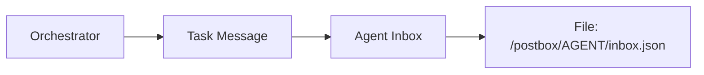
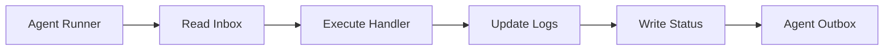
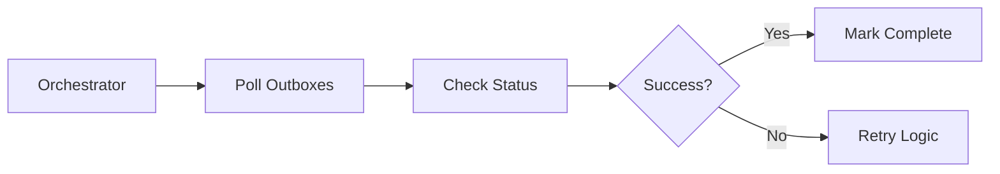

# Agent Communication System - Execution Flow

This document describes the complete execution flow of the Agent Communication System, from plan loading through task completion, including retry/fallback logic, monitoring, and configuration options.

## Table of Contents

1. [System Overview](#system-overview)
2. [Plan Structure](#plan-structure)
3. [Execution Lifecycle](#execution-lifecycle)
4. [Retry and Fallback Logic](#retry-and-fallback-logic)
5. [File Flow Architecture](#file-flow-architecture)
6. [Logging and Monitoring](#logging-and-monitoring)
7. [Context File Access](#context-file-access)
8. [Configuration Options](#configuration-options)
9. [Complete Example](#complete-example)

## System Overview

The Agent Communication System orchestrates multi-agent collaboration through:
- File-based message passing via inbox/outbox JSON files
- YAML execution plans defining tasks and dependencies
- An orchestrator (ARCH) that coordinates task execution
- Individual agent runners that process tasks
- A central router for message distribution

### Key Components

1. **ARCH Orchestrator** (`arch_orchestrator.py`)
   - Loads and parses YAML execution plans
   - Dispatches tasks to agent inboxes
   - Monitors task completion
   - Handles retry and fallback logic

2. **Agent Runners** (`agent_runner.py`)
   - Read tasks from inbox
   - Execute task handlers
   - Update task logs
   - Write status to outbox

3. **Message Router** (`router/router.py`)
   - Scans agent outboxes
   - Routes messages to recipient inboxes
   - Enforces TTL and retry limits
   - Logs routing decisions

## Plan Structure

### YAML Schema

```yaml
metadata:
  plan_id: "unique_plan_identifier"
  version: "1.0.0"
  created: "2024-03-19T10:00:00Z"
  description: "Plan description"
  priority: "high"
  timeout: "30m"

tasks:
  - task_id: "unique-task-id"
    agent: "CA"  # Target agent (CC, CA, WA, ARCH)
    type: "task_assignment"
    description: "What the task does"
    priority: "high"
    deadline: "2024-03-19T10:30:00Z"
    
    content:
      action: "specific_action"
      parameters:
        key: "value"
    
    # Retry configuration
    max_retries: 3
    fallback_agent: "CC"  # Alternative agent on failure
    
    # Dependencies
    dependencies: ["previous-task-id"]
    
    timeout: "5m"
```

### Task Fields

- **task_id**: Unique identifier for the task
- **agent**: Target agent to execute the task
- **type**: Message type (usually "task_assignment")
- **max_retries**: Number of retry attempts (default: 0)
- **fallback_agent**: Alternative agent if primary fails
- **dependencies**: List of task IDs that must complete first

## Execution Lifecycle

### 1. Plan Loading Phase


The orchestrator:
1. Loads the YAML plan file
2. Validates the structure and schema
3. Builds a task dependency graph
4. Initializes execution state

### 2. Task Dispatch Phase



For each task without unmet dependencies:
1. Create task_assignment message
2. Add retry count to metadata
3. Write to target agent's inbox.json
4. Log dispatch event

### 3. Agent Execution Phase



The agent runner:
1. Reads task from inbox.json
2. Validates message against schema
3. Executes appropriate handler
4. Updates task_log.md
5. Writes task_status to outbox.json

### 4. Status Monitoring Phase



The orchestrator continuously:
1. Monitors agent outboxes for status messages
2. Updates task state based on status
3. Triggers retry or fallback on failure
4. Checks for newly unblocked tasks

### 5. Completion Phase


When all tasks complete:
1. Generate execution summary
2. Log final statistics
3. Clean up temporary state
4. Exit with appropriate code

## Retry and Fallback Logic

### Retry Mechanism

```python
def execute_task_with_retry(self, task: Dict) -> tuple[bool, str]:
    max_retries = task.get('max_retries', 0)
    retry_count = 0
    
    while retry_count <= max_retries:
        # Dispatch task
        success = self.dispatch_and_monitor(task)
        
        if success:
            return True, "Task completed"
            
        retry_count += 1
        if retry_count <= max_retries:
            # Exponential backoff
            time.sleep(5 * (2 ** retry_count))
    
    return False, "Max retries exhausted"
```

### Fallback Routing

```python
def handle_task_failure(self, task: Dict) -> bool:
    fallback_agent = task.get('fallback_agent')
    
    if fallback_agent:
        # Update task to use fallback agent
        task['agent'] = fallback_agent
        task['metadata']['fallback'] = True
        
        # Attempt with fallback agent
        return self.dispatch_and_monitor(task)
    
    return False
```

### Retry Flow

1. Task fails initial execution
2. Check retry count vs max_retries
3. If retries available:
   - Increment retry count
   - Wait with exponential backoff
   - Re-dispatch to same agent
4. If max retries exhausted:
   - Check for fallback_agent
   - Route to fallback if available
   - Mark as failed if no fallback

## File Flow Architecture

### Message Flow Diagram

```
┌─────────────┐     ┌─────────────┐     ┌─────────────┐
│   ARCH      │     │   Router    │     │   Agent     │
│ Orchestrator│     │             │     │   Runner    │
└─────┬───────┘     └──────┬──────┘     └─────┬───────┘
      │                    │                  │
      │ 1. Write task      │                  │
      ├──────────────────► │                  │
      │  to agent inbox    │                  │
      │                    │                  │
      │                    │ 2. Agent reads   │
      │                    │    from inbox    │
      │                    │ ◄────────────────┤
      │                    │                  │
      │                    │                  │ 3. Execute
      │                    │                  │    task
      │                    │                  │
      │                    │ 4. Write status  │
      │                    │    to outbox     │
      │                    │ ◄────────────────┤
      │                    │                  │
      │ 5. Router delivers │                  │
      │    status message  │                  │
      │ ◄──────────────────┤                  │
      │                    │                  │
```

### File Locations

```
/agent-comms-mvp/
├── postbox/
│   ├── CC/
│   │   ├── inbox.json    # Incoming tasks
│   │   ├── outbox.json   # Status updates
│   │   └── task_log.md   # Execution log
│   ├── CA/
│   │   └── (same structure)
│   ├── WA/
│   │   └── (same structure)
│   └── ARCH/
│       └── (same structure)
├── plans/
│   └── *.yaml            # Execution plans
├── logs/
│   └── orchestrator.log  # Orchestrator logs
└── processed/
    └── *.json            # Archived messages
```

## Logging and Monitoring

### Log Files

1. **Orchestrator Log** (`logs/orchestrator.log`)
   ```
   2024-03-19 10:00:00 - Starting plan execution: plan_001
   2024-03-19 10:00:01 - Dispatched task-1 to CA
   2024-03-19 10:00:05 - Task task-1 failed, retrying (1/3)
   2024-03-19 10:00:15 - Task task-1 succeeded on retry
   ```

2. **Task Logs** (`postbox/*/task_log.md`)
   ```markdown
   ## 2024-03-19T10:00:05.123456
   **Status**: ❌ Failed
   **Message ID**: task-001
   **From**: ARCH
   **Type**: task_assignment
   **Task ID**: task-1
   **Details**: Connection timeout
   
   ## 2024-03-19T10:00:15.789012
   **Status**: ✅ Success
   **Message ID**: task-001-retry-1
   **From**: ARCH
   **Type**: task_assignment
   **Task ID**: task-1
   **Details**: Task completed successfully
   ```

3. **Router Log** (`router/router_log.md`)
   ```
   2024-03-19 10:00:20 - Routed message abc-123 from CA to ARCH
   2024-03-19 10:00:21 - Message xyz-789 expired (TTL exceeded)
   ```

### Monitoring Tools

1. **Inbox Monitor** (`tools/inbox_monitor.py`)
   - Real-time view of agent inboxes
   - Message count statistics
   - Interactive message inspection

2. **Flow Visualizer** (`tools/flow_visualizer.py`)
   - Terminal dashboard for outbox monitoring
   - Live message flow tracking
   - Status summaries

3. **Task Status Tracker** (`tools/task_status_tracker.py`)
   - Cross-agent task status
   - Progress tracking
   - Historical task data

## Context File Access

### Agent Context Files

Location: `/context/*_context.json`

```json
{
  "agent_id": "CC",
  "last_task": "task-042",
  "performance_metrics": {
    "success_rate": 0.95,
    "avg_response_time": 45.2
  },
  "preferences": {
    "retry_delay": 5,
    "max_concurrent_tasks": 3
  }
}
```

### Context Usage

1. **During Initialization**
   ```python
   # agent_runner.py
   if args.init:
       context = load_agent_context(agent_id)
       display_agent_profile(context)
   ```

2. **During Execution**
   ```python
   # Check performance warnings
   if context.get('performance_metrics', {}).get('success_rate', 1.0) < 0.7:
       logger.warning(f"Low success rate for {agent_id}")
   ```

3. **Learning Integration**
   ```python
   # router.py with --use-learning
   if use_learning:
       best_agent = select_agent_by_performance(task_type)
   ```

## Configuration Options

### Orchestrator Flags

```bash
python arch_orchestrator.py [plan.yaml] [options]

Options:
  --timeout SECONDS    Overall execution timeout (default: 3600)
  --max-retries N      Global retry limit (default: 3)
  --watch              Continuous execution mode
  --dry-run            Validate plan without execution
```

### Agent Runner Flags

```bash
python agent_runner.py --agent AGENT [options]

Options:
  --agent AGENT        Agent ID (CC, CA, WA, ARCH)
  --init               Initialize agent and show profile
  --simulate           Simulate task execution
  --clear              Clear inbox and outbox
  --force              Override dependency checks
  --use-learning       Apply learning-based optimizations
```

### Router Flags

```bash
python router/router.py [options]

Options:
  --use-learning       Enable learning-based routing
  --max-age SECONDS    Message expiration time
  --batch-size N       Process N messages at once
```

### Environment Variables

```bash
# Set base directory
export AGENT_COMMS_BASE=/path/to/agent-comms-mvp

# Enable debug logging
export AGENT_DEBUG=1

# Set orchestrator timeout
export ORCH_TIMEOUT=7200
```

## Complete Example

### 1. Create Execution Plan

`plans/data_pipeline.yaml`:
```yaml
metadata:
  plan_id: "data_pipeline_001"
  version: "1.0.0"
  description: "ETL pipeline with retry and fallback"

tasks:
  - task_id: "extract-data"
    agent: "CC"
    type: "task_assignment"
    description: "Extract data from source"
    max_retries: 2
    fallback_agent: "CA"
    content:
      action: "extract"
      parameters:
        source: "database"
        query: "SELECT * FROM users"
    
  - task_id: "transform-data"
    agent: "CA"
    type: "task_assignment"
    description: "Transform extracted data"
    dependencies: ["extract-data"]
    content:
      action: "transform"
      parameters:
        schema: "v2"
    
  - task_id: "load-data"
    agent: "CC"
    type: "task_assignment"
    description: "Load data to warehouse"
    dependencies: ["transform-data"]
    max_retries: 3
    content:
      action: "load"
      parameters:
        destination: "warehouse"
```

### 2. Execute Plan

```bash
# Start orchestrator
python arch_orchestrator.py plans/data_pipeline.yaml

# In separate terminals, start agents
python agent_runner.py --agent CC
python agent_runner.py --agent CA

# Monitor execution
python tools/flow_visualizer.py
```

### 3. Execution Flow

1. **Orchestrator starts**
   - Loads data_pipeline.yaml
   - Identifies extract-data as ready (no dependencies)
   - Writes task to CC's inbox

2. **CC processes extract-data**
   - Reads from inbox.json
   - Attempts extraction
   - If fails: orchestrator retries up to 2 times
   - If still fails: routes to CA (fallback)
   - Writes success to outbox.json

3. **Orchestrator monitors**
   - Reads CC's outbox
   - Marks extract-data complete
   - Unblocks transform-data
   - Dispatches to CA's inbox

4. **CA processes transform-data**
   - Reads task from inbox
   - Transforms data
   - Writes status to outbox

5. **CC processes load-data**
   - Final task in pipeline
   - Loads to warehouse
   - Pipeline complete

### 4. Result Files

After execution:
- `logs/orchestrator.log`: Full execution trace
- `postbox/*/task_log.md`: Individual agent logs
- `processed/*.json`: Archived messages
- Execution summary displayed in terminal

## Summary

The Agent Communication System provides a robust framework for multi-agent task orchestration with:
- File-based message passing for reliability
- Configurable retry and fallback mechanisms
- Comprehensive logging and monitoring
- Flexible execution plans via YAML
- Learning-based optimizations

The system ensures reliable task execution through automatic retry logic, intelligent fallback routing, and detailed execution tracking.